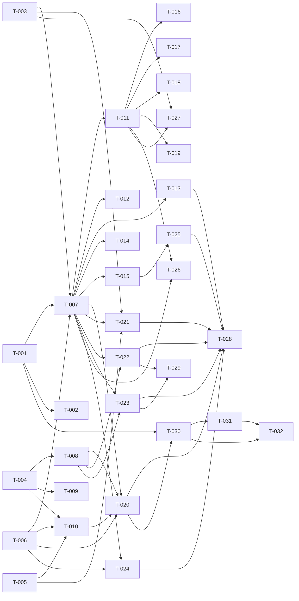

# Build Site

34 tasks across 5 tiers from 3 kits.

---

## Tier 0 — No Dependencies (Start Here)

| Task | Title | Cavekit | Requirement | Effort |
|------|-------|---------|-------------|--------|
| T-001 | Initialize Astro + TypeScript project | cavekit-site-shell.md | R1 | M |
| T-002 | Enable Content Collections infrastructure | cavekit-site-shell.md | R1 | S |
| T-003 | Global Hacker-Retro theme CSS | cavekit-site-shell.md | R4 | M |
| T-004 | Declare Projects collection schema | cavekit-content.md | R1 | M |
| T-005 | Create About content file with frontmatter | cavekit-content.md | R3 | S |
| T-006 | Create central site config module | cavekit-content.md | R4 | S |

## Tier 1 — Depends on Tier 0

| Task | Title | Cavekit | Requirement | blockedBy | Effort |
|------|-------|---------|-------------|-----------|--------|
| T-007 | BaseLayout with head/meta/slot/theme body | cavekit-site-shell.md | R2 | T-001, T-003, T-006 | M |
| T-008 | Projects collection access (filter/sort/render) | cavekit-content.md | R2 | T-004 | M |
| T-009 | Schema validation error behaviour verification | cavekit-content.md | R6 | T-004 | S |
| T-010 | Seed Projects markdown entries | cavekit-content.md | R5 | T-004, T-005, T-006 | M |

## Tier 2 — Depends on Tier 1

| Task | Title | Cavekit | Requirement | blockedBy | Effort |
|------|-------|---------|-------------|-----------|--------|
| T-011 | Header with site-name and nav links | cavekit-site-shell.md | R3 | T-007 | M |
| T-012 | Footer component | cavekit-site-shell.md | R2 | T-007 | S |
| T-013 | SEO: per-page title/description + OG tags | cavekit-site-shell.md | R7 | T-007 | M |
| T-014 | sitemap.xml and robots.txt in build output | cavekit-site-shell.md | R7 | T-007 | S |
| T-015 | Custom 404 page using BaseLayout | cavekit-site-shell.md | R8 | T-007 | S |

## Tier 3 — Depends on Tier 2

| Task | Title | Cavekit | Requirement | blockedBy | Effort |
|------|-------|---------|-------------|-----------|--------|
| T-016 | Active-link / aria-current indicator on nav | cavekit-site-shell.md | R3 | T-011 | S |
| T-017 | Keyboard focus indicators for nav | cavekit-site-shell.md | R3 | T-011 | S |
| T-018 | Responsive Header/nav (stacked or burger) | cavekit-site-shell.md | R5 | T-011 | M |
| T-019 | Responsive layout no horizontal scroll at 375/640/1280 | cavekit-site-shell.md | R5 | T-011 | M |
| T-020 | Home page at `/` with CTAs and featured teaser | cavekit-pages.md | R1 | T-007, T-008, T-006, T-010 | M |
| T-021 | About page at `/about` | cavekit-pages.md | R2 | T-007, T-003, T-005 | M |
| T-022 | Projects list page at `/projects` | cavekit-pages.md | R3 | T-007, T-008 | M |
| T-023 | Project detail dynamic route `/projects/[slug]` | cavekit-pages.md | R4 | T-007, T-008 | M |
| T-024 | Contact page at `/contact` | cavekit-pages.md | R5 | T-007, T-006 | M |
| T-025 | 404 page behaviour (heading + link to `/`) | cavekit-pages.md | R6 | T-015 | S |
| T-026 | Skip-to-content link + semantic landmarks | cavekit-pages.md | R7 | T-007, T-011 | M |
| T-027 | WCAG AA contrast + focus indicators audit | cavekit-pages.md | R7 | T-003, T-011 | M |

## Tier 4 — Depends on Tier 3

| Task | Title | Cavekit | Requirement | blockedBy | Effort |
|------|-------|---------|-------------|-----------|--------|
| T-028 | Per-page metadata wiring for every page | cavekit-pages.md | R8 | T-013, T-020, T-021, T-022, T-023, T-024, T-025 | M |
| T-029 | Article wrapper + cover alt enforcement on project pages | cavekit-pages.md | R7 | T-022, T-023 | S |
| T-030 | GitHub Actions deploy workflow (build + publish) | cavekit-site-shell.md | R6 | T-001, T-020 | M |
| T-031 | CNAME file `www.heinemann.foo` in deployed output | cavekit-site-shell.md | R6 | T-030 | S |
| T-032 | Verify deployed Home serves 200 on custom domain | cavekit-site-shell.md | R6 | T-030, T-031 | S |

---

## Task Details

### T-001: Initialize Astro + TypeScript project
**Cavekit:** cavekit-site-shell.md — R1
**Acceptance Criteria Covered:** dev command starts local server; build produces static HTML; TypeScript type-check passes on clean checkout.
**Description:** Scaffold an Astro project with TypeScript strict mode. Ensure `astro dev`, `astro build`, and `tsc --noEmit` (or `astro check`) all succeed on a clean checkout.

### T-002: Enable Content Collections infrastructure
**Cavekit:** cavekit-site-shell.md — R1
**Acceptance Criteria Covered:** Content Collections enabled and at least one declared collection is discovered by the build.
**Description:** Create `src/content/config.ts` exporting at least one collection so Astro's content layer is enabled and recognised by the build.

### T-003: Global Hacker-Retro theme CSS
**Cavekit:** cavekit-site-shell.md — R4
**Acceptance Criteria Covered:** body background `#111`; base font Hack Nerd Font with monospace fallback; accent colour `rgba(0,255,26,0.5)` for links/hover; header box-shadow `0 2px 20px rgba(0,255,26,0.5)`.
**Description:** Author global CSS (imported via BaseLayout) that sets the dark background, monospace stack, accent colour for interactive elements, and the header glow shadow.

### T-004: Declare Projects collection schema
**Cavekit:** cavekit-content.md — R1
**Acceptance Criteria Covered:** `projects` collection declared under `src/content/projects/`; schema validates title, description (max 200), tech (array min 1), repoUrl/liveUrl (URL, optional), cover (image, optional), date (date, required), featured/draft booleans with default `false`; missing/wrong-type fields fail `astro build`.
**Description:** Define the `projects` collection in `src/content/config.ts` with a Zod schema matching all frontmatter rules, including defaults for booleans and the image reference for `cover`.

### T-005: Create About content file with frontmatter
**Cavekit:** cavekit-content.md — R3
**Acceptance Criteria Covered:** `src/content/about.md` exists; frontmatter fields `name`, `role`, `location`, `email` as strings; markdown body renders as HTML at build time; no runtime fetches.
**Description:** Create `src/content/about.md` with the four required frontmatter string fields and placeholder Markdown bio. Ensure resolution is static (imported or via content API) with no runtime fetches.

### T-006: Create central site config module
**Cavekit:** cavekit-content.md — R4
**Acceptance Criteria Covered:** `src/config.ts` exists and exports typed config; fields `siteName`, `siteUrl` equal to `https://www.heinemann.foo`, `author`, `description`, `socialLinks` array with `platform`/`url`/`icon`; importing produces no TS errors.
**Description:** Create `src/config.ts` exporting a typed `siteConfig` object matching the schema. Include a `SocialLink` type and ensure imports compile cleanly.

### T-007: BaseLayout with head/meta/slot/theme body
**Cavekit:** cavekit-site-shell.md — R2
**Acceptance Criteria Covered:** `<head>` with per-page title, description, favicon, and Open Graph tags; Header + Footer rendered on every page; content slot exposed; body/root background `#111`.
**Description:** Implement `src/layouts/BaseLayout.astro` accepting `title`, `description`, and canonical/type props, rendering head metadata, importing global theme CSS, mounting Header + Footer, and exposing a default slot.

### T-008: Projects collection access (filter/sort/render)
**Cavekit:** cavekit-content.md — R2
**Acceptance Criteria Covered:** `getCollection('projects')` returns non-draft entries; sortable by date descending; drafts excluded from production output; entry body renderable to HTML.
**Description:** Add a helper (or document usage) that calls `getCollection('projects', entry => !entry.data.draft)` and sorts by `date` descending. Confirm entry `render()` produces HTML.

### T-009: Schema validation error behaviour verification
**Cavekit:** cavekit-content.md — R6
**Acceptance Criteria Covered:** removing a required field causes non-zero exit; error names offending file and field; wrong type (string instead of array for `tech`) also fails with field named.
**Description:** Write a short verification routine (doc + scripted check) that temporarily corrupts a projects entry and confirms `astro build` exits non-zero with file + field in the message. Revert after verification.

### T-010: Seed Projects markdown entries
**Cavekit:** cavekit-content.md — R5
**Acceptance Criteria Covered:** at least 2 Markdown project entries validate against the schema; About `email: tim@heinemann.foo`; config or About contains GitHub (`t1mdotcom`), LinkedIn (`tim-heinemann-524764190`), Xing (`Tim_Heinemann15`), and GPG (`https://keyserver.ubuntu.com/pks/lookup?search=tim%40heinemann.foo&fingerprint=on&op=index`) links.
**Description:** Author two or more real Markdown project entries under `src/content/projects/`, set the About email, and populate `socialLinks` in `src/config.ts` with GitHub, LinkedIn, Xing, and GPG entries.

### T-011: Header with site-name and nav links
**Cavekit:** cavekit-site-shell.md — R3
**Acceptance Criteria Covered:** site-name element linking to `/`; nav links `About`, `Projects`, `Contact` to `/about`, `/projects`, `/contact`.
**Description:** Implement `src/components/Header.astro` reading `siteName` from config, rendering a `<nav>` with the three required links. Apply the header box-shadow from the theme.

### T-012: Footer component
**Cavekit:** cavekit-site-shell.md — R2
**Acceptance Criteria Covered:** Footer rendered on every page that uses BaseLayout.
**Description:** Implement `src/components/Footer.astro` showing author/siteName from config. Mount it inside BaseLayout so every page includes it.

### T-013: SEO per-page title/description + OG tags
**Cavekit:** cavekit-site-shell.md — R7
**Acceptance Criteria Covered:** BaseLayout renders per-page title/description into `<title>` and `<meta name="description">`; Open Graph tags (`og:title`, `og:description`, `og:url`, `og:type`) derived from page props; also satisfies R2 head metadata criterion.
**Description:** Wire BaseLayout props into head tags. Compute canonical URL from `siteUrl + Astro.url.pathname`. Default `og:type` to `website` with override support for detail pages.

### T-014: sitemap.xml and robots.txt in build output
**Cavekit:** cavekit-site-shell.md — R7
**Acceptance Criteria Covered:** production build output contains `sitemap.xml` listing all generated pages; `robots.txt` referencing the sitemap URL.
**Description:** Add `@astrojs/sitemap` integration (configured with `siteUrl`) and author `public/robots.txt` containing `Sitemap: https://www.heinemann.foo/sitemap-index.xml` (or equivalent emitted path).

### T-015: Custom 404 page using BaseLayout
**Cavekit:** cavekit-site-shell.md — R8
**Acceptance Criteria Covered:** 404 route rendered in production build; uses BaseLayout (Header, Footer, theme); contains at least one link back to `/`.
**Description:** Create `src/pages/404.astro` that wraps content in BaseLayout, includes a heading introducing the error, and a link to `/`.

### T-016: Active-link / aria-current indicator on nav
**Cavekit:** cavekit-site-shell.md — R3
**Acceptance Criteria Covered:** nav link for current page visually distinguished via class, style, or `aria-current="page"`.
**Description:** In Header, compare `Astro.url.pathname` to each link's href and apply `aria-current="page"` (and an active class) when matched.

### T-017: Keyboard focus indicators for nav
**Cavekit:** cavekit-site-shell.md — R3
**Acceptance Criteria Covered:** all nav links reachable via Tab with a visible focus indicator.
**Description:** Ensure global CSS (or Header-scoped CSS) defines a visible `:focus-visible` outline for nav anchors that meets contrast against `#111`.

### T-018: Responsive Header/nav (stacked or burger)
**Cavekit:** cavekit-site-shell.md — R5
**Acceptance Criteria Covered:** below 640px nav stacked under site-name or accessible via burger toggle; nav remains reachable/activatable at 375px, 640px, 1280px.
**Description:** Implement mobile breakpoint CSS (and optional disclosure button) ensuring the nav is usable at 375px, 640px, and 1280px.

### T-019: Responsive layout no horizontal scroll at 375/640/1280
**Cavekit:** cavekit-site-shell.md — R5
**Acceptance Criteria Covered:** at 375px no element triggers horizontal scroll on Home.
**Description:** Audit global layout widths, add `max-width: 100%` / `overflow-x: hidden` safeguards, constrain Home hero content, and verify at 375/640/1280.

### T-020: Home page at `/` with CTAs and featured teaser
**Cavekit:** cavekit-pages.md — R1
**Acceptance Criteria Covered:** route `/` exists inside BaseLayout; displays author name and role from config or About frontmatter; 1–2 line intro; CTA links to `/projects` and `/contact`; if any project `featured: true`, render up to three featured teasers linking to detail pages.
**Description:** Implement `src/pages/index.astro` loading About + config, rendering identity + intro, two CTA links, and a conditional featured teaser pulling up to three `featured && !draft` projects sorted by date.

### T-021: About page at `/about`
**Cavekit:** cavekit-pages.md — R2
**Acceptance Criteria Covered:** route `/about` inside BaseLayout; header shows `name`, `role`, `location`; body renders About Markdown as HTML; body links use accent colour; body uses monospace stack.
**Description:** Implement `src/pages/about.astro` loading the About entry, rendering the frontmatter header and `<Content />`. Scope CSS so the rendered body inherits accent link colour and monospace font.

### T-022: Projects list page at `/projects`
**Cavekit:** cavekit-pages.md — R3
**Acceptance Criteria Covered:** route `/projects` inside BaseLayout; all non-draft entries rendered; sorted by date descending; each entry shows `title`, `description`, `tech` tags; renders `cover` when present; repoUrl/liveUrl links when present; title links to detail page; single static list/grid (no infinite scroll).
**Description:** Implement `src/pages/projects/index.astro` consuming the helper from T-008, rendering a grid/list of entries with conditional cover, repo, and live links, and title linking to `/projects/[slug]`.

### T-023: Project detail dynamic route `/projects/[slug]`
**Cavekit:** cavekit-pages.md — R4
**Acceptance Criteria Covered:** dynamic route via `getStaticPaths` for every non-draft project; renders inside BaseLayout; renders Markdown body as HTML; displays `title`, `date`, `tech`, `repoUrl`/`liveUrl` when present; draft entries 404 in production.
**Description:** Implement `src/pages/projects/[slug].astro` with `getStaticPaths` filtering `!draft`, rendering the entry body via `render()`, and displaying required metadata and conditional external links.

### T-024: Contact page at `/contact`
**Cavekit:** cavekit-pages.md — R5
**Acceptance Criteria Covered:** route `/contact` inside BaseLayout; `mailto:` link using config or About email; GPG link equal to the specified keyserver URL; links to GitHub, LinkedIn, Xing from `socialLinks`; no HTML form.
**Description:** Implement `src/pages/contact.astro` listing a `mailto:` link, the GPG keyserver link, and the three social profile links. Ensure no `<form>` element is rendered.

### T-025: 404 page behaviour (heading + link to `/`)
**Cavekit:** cavekit-pages.md — R6
**Acceptance Criteria Covered:** at least one visible heading introducing the error state; link with `href="/"`; renders inside BaseLayout.
**Description:** Extend T-015's `404.astro` with a prominent `<h1>` (e.g., "404 — not found") and a visible anchor linking back to `/`.

### T-026: Skip-to-content link + semantic landmarks
**Cavekit:** cavekit-pages.md — R7
**Acceptance Criteria Covered:** every page has exactly one `<h1>`, a `<nav>` in Header, and a `<main>` wrapping primary content; every page has a skip-to-content link that is first focusable and jumps to `<main>`.
**Description:** Add a skip link in BaseLayout (first child, visually hidden until focused, targeting `#main`). Ensure `<main id="main">` wraps the slot and every page ships exactly one `<h1>`.

### T-027: WCAG AA contrast + focus indicators audit
**Cavekit:** cavekit-pages.md — R7
**Acceptance Criteria Covered:** every interactive element has a visible focus indicator when keyboard-focused; body and link text pass WCAG AA contrast against `#111`.
**Description:** Run an automated contrast checker (e.g., axe or pa11y) against the built pages, adjust body text colour / link colour to meet AA, and ensure global `:focus-visible` styles apply to all interactive elements.

### T-028: Per-page metadata wiring for every page
**Cavekit:** cavekit-pages.md — R8
**Acceptance Criteria Covered:** every page passes a unique `title` to BaseLayout; every page passes a `description`; rendered `<title>` and `<meta name="description">` reflect those; `og:title`/`og:description` match.
**Description:** Audit every `src/pages/**` file (Home, About, Projects list, Project detail, Contact, 404) and pass unique `title` and `description` props to BaseLayout. Verify by inspecting built HTML.

### T-029: Article wrapper + cover alt enforcement on project pages
**Cavekit:** cavekit-pages.md — R7
**Acceptance Criteria Covered:** project detail wraps body in `<article>`; every rendered `cover` image has a non-empty `alt` attribute.
**Description:** In the project detail template, wrap rendered body in `<article>`. In the list and detail covers, use the project `title` (or an explicit alt field) as the image `alt`, guarding against empty strings.

### T-030: GitHub Actions deploy workflow (build + publish)
**Cavekit:** cavekit-site-shell.md — R6
**Acceptance Criteria Covered:** workflow triggers on push to `main`; runs Astro build; publishes output to `gh-pages` branch or equivalent Pages deployment target.
**Description:** Add `.github/workflows/deploy.yml` that checks out, installs dependencies, runs `astro build`, and deploys to GitHub Pages (using `actions/deploy-pages` or `peaceiris/actions-gh-pages`).

### T-031: CNAME file `www.heinemann.foo` in deployed output
**Cavekit:** cavekit-site-shell.md — R6
**Acceptance Criteria Covered:** deployed output contains `CNAME` with content `www.heinemann.foo`.
**Description:** Add `public/CNAME` (single line: `www.heinemann.foo`) so it is copied to the deployed site root on every build.

### T-032: Verify deployed Home serves 200 on custom domain
**Cavekit:** cavekit-site-shell.md — R6
**Acceptance Criteria Covered:** after successful workflow, `https://www.heinemann.foo` serves the Home page with HTTP 200.
**Description:** After a workflow run, verify `curl -I https://www.heinemann.foo` returns HTTP 200 and the body matches the Home page. Document the check.

---

## Summary

| Tier | Tasks | Effort |
|------|-------|--------|
| 0 | 6 | 2 S, 4 M |
| 1 | 4 | 1 S, 3 M |
| 2 | 5 | 2 S, 3 M |
| 3 | 12 | 3 S, 9 M |
| 4 | 5 | 2 S, 3 M |

**Total: 32 tasks, 5 tiers**

## Coverage Matrix

| Cavekit | Req | Criterion | Task(s) | Status |
|---------|-----|-----------|---------|--------|
| cavekit-site-shell.md | R1 | astro dev starts local server without errors | T-001 | COVERED |
| cavekit-site-shell.md | R1 | astro build produces static HTML output | T-001 | COVERED |
| cavekit-site-shell.md | R1 | TypeScript type-check passes | T-001 | COVERED |
| cavekit-site-shell.md | R1 | Content Collections enabled and discoverable | T-002 | COVERED |
| cavekit-site-shell.md | R2 | head with title/description/favicon/OG tags | T-007, T-013 | COVERED |
| cavekit-site-shell.md | R2 | Header and Footer on every page | T-007, T-011, T-012 | COVERED |
| cavekit-site-shell.md | R2 | content slot exposed | T-007 | COVERED |
| cavekit-site-shell.md | R2 | body/root background `#111` | T-003, T-007 | COVERED |
| cavekit-site-shell.md | R3 | site-name element linking `/` | T-011 | COVERED |
| cavekit-site-shell.md | R3 | nav links About/Projects/Contact to correct routes | T-011 | COVERED |
| cavekit-site-shell.md | R3 | current-page nav link visually distinguished | T-016 | COVERED |
| cavekit-site-shell.md | R3 | keyboard Tab reachable with visible focus | T-017 | COVERED |
| cavekit-site-shell.md | R4 | body background `#111` | T-003 | COVERED |
| cavekit-site-shell.md | R4 | base font Hack Nerd Font + monospace fallback | T-003 | COVERED |
| cavekit-site-shell.md | R4 | accent `rgba(0,255,26,0.5)` for links/hover | T-003 | COVERED |
| cavekit-site-shell.md | R4 | header box-shadow `0 2px 20px rgba(0,255,26,0.5)` | T-003 | COVERED |
| cavekit-site-shell.md | R5 | no horizontal scroll at 375px on Home | T-019 | COVERED |
| cavekit-site-shell.md | R5 | below 640px nav stacked or burger toggle | T-018 | COVERED |
| cavekit-site-shell.md | R5 | nav reachable/activatable at 375/640/1280 | T-018 | COVERED |
| cavekit-site-shell.md | R6 | workflow triggers on push to main | T-030 | COVERED |
| cavekit-site-shell.md | R6 | workflow runs build and publishes output | T-030 | COVERED |
| cavekit-site-shell.md | R6 | deployed output contains CNAME `www.heinemann.foo` | T-031 | COVERED |
| cavekit-site-shell.md | R6 | `https://www.heinemann.foo` serves Home 200 | T-032 | COVERED |
| cavekit-site-shell.md | R7 | BaseLayout accepts per-page title/description | T-013 | COVERED |
| cavekit-site-shell.md | R7 | OG tags rendered from props | T-013 | COVERED |
| cavekit-site-shell.md | R7 | sitemap.xml in build output | T-014 | COVERED |
| cavekit-site-shell.md | R7 | robots.txt references sitemap URL | T-014 | COVERED |
| cavekit-site-shell.md | R8 | 404 route in production build output | T-015 | COVERED |
| cavekit-site-shell.md | R8 | 404 uses BaseLayout | T-015 | COVERED |
| cavekit-site-shell.md | R8 | 404 contains a link to `/` | T-015, T-025 | COVERED |
| cavekit-content.md | R1 | `projects` collection declared under `src/content/projects/` | T-004 | COVERED |
| cavekit-content.md | R1 | schema validates title/description/tech/repoUrl/liveUrl/cover/date/featured/draft | T-004 | COVERED |
| cavekit-content.md | R1 | missing/wrong-type fields fail astro build | T-004, T-009 | COVERED |
| cavekit-content.md | R2 | getCollection returns non-draft entries | T-008 | COVERED |
| cavekit-content.md | R2 | entries sortable by date (newest first) | T-008 | COVERED |
| cavekit-content.md | R2 | drafts excluded from production build | T-008 | COVERED |
| cavekit-content.md | R2 | entry body renderable to HTML | T-008 | COVERED |
| cavekit-content.md | R3 | `src/content/about.md` exists | T-005 | COVERED |
| cavekit-content.md | R3 | frontmatter name/role/location/email as strings | T-005 | COVERED |
| cavekit-content.md | R3 | body renderable as HTML at build time | T-005 | COVERED |
| cavekit-content.md | R3 | no runtime fetch for About content | T-005 | COVERED |
| cavekit-content.md | R4 | `src/config.ts` exports typed config | T-006 | COVERED |
| cavekit-content.md | R4 | fields siteName/siteUrl/author/description/socialLinks | T-006 | COVERED |
| cavekit-content.md | R4 | socialLinks items have platform/url/icon | T-006 | COVERED |
| cavekit-content.md | R4 | importing config produces no TS errors | T-006 | COVERED |
| cavekit-content.md | R5 | at least 2 projects validating against schema | T-010 | COVERED |
| cavekit-content.md | R5 | About email `tim@heinemann.foo` | T-010 | COVERED |
| cavekit-content.md | R5 | GitHub link to `t1mdotcom` | T-010 | COVERED |
| cavekit-content.md | R5 | LinkedIn link with slug `tim-heinemann-524764190` | T-010 | COVERED |
| cavekit-content.md | R5 | Xing link with slug `Tim_Heinemann15` | T-010 | COVERED |
| cavekit-content.md | R5 | GPG link equals the keyserver URL | T-010 | COVERED |
| cavekit-content.md | R6 | removing required field causes non-zero exit | T-009 | COVERED |
| cavekit-content.md | R6 | error names offending file and field | T-009 | COVERED |
| cavekit-content.md | R6 | wrong type fails build and names field | T-009 | COVERED |
| cavekit-pages.md | R1 | `/` exists inside BaseLayout | T-020 | COVERED |
| cavekit-pages.md | R1 | displays author name and role | T-020 | COVERED |
| cavekit-pages.md | R1 | 1–2 line intro sentence | T-020 | COVERED |
| cavekit-pages.md | R1 | CTA links to `/projects` and `/contact` | T-020 | COVERED |
| cavekit-pages.md | R1 | featured teaser up to three with title + link | T-020 | COVERED |
| cavekit-pages.md | R2 | `/about` inside BaseLayout | T-021 | COVERED |
| cavekit-pages.md | R2 | header shows name/role/location | T-021 | COVERED |
| cavekit-pages.md | R2 | body renders About Markdown as HTML | T-021 | COVERED |
| cavekit-pages.md | R2 | body links use accent colour | T-021, T-003 | COVERED |
| cavekit-pages.md | R2 | body uses monospace stack | T-021, T-003 | COVERED |
| cavekit-pages.md | R3 | `/projects` inside BaseLayout | T-022 | COVERED |
| cavekit-pages.md | R3 | all non-draft entries rendered | T-022 | COVERED |
| cavekit-pages.md | R3 | ordered by date descending | T-022 | COVERED |
| cavekit-pages.md | R3 | shows title/description/tech tags | T-022 | COVERED |
| cavekit-pages.md | R3 | shows cover when present | T-022 | COVERED |
| cavekit-pages.md | R3 | repoUrl/liveUrl links when present | T-022 | COVERED |
| cavekit-pages.md | R3 | title links to detail page | T-022 | COVERED |
| cavekit-pages.md | R3 | single static list/grid, no infinite scroll | T-022 | COVERED |
| cavekit-pages.md | R4 | `/projects/[slug]` via getStaticPaths | T-023 | COVERED |
| cavekit-pages.md | R4 | detail renders inside BaseLayout | T-023 | COVERED |
| cavekit-pages.md | R4 | detail renders Markdown body as HTML | T-023 | COVERED |
| cavekit-pages.md | R4 | detail displays title/date/tech and repo/live links when present | T-023 | COVERED |
| cavekit-pages.md | R4 | draft detail page yields 404 in production | T-023 | COVERED |
| cavekit-pages.md | R5 | `/contact` inside BaseLayout | T-024 | COVERED |
| cavekit-pages.md | R5 | mailto link using config/About email | T-024 | COVERED |
| cavekit-pages.md | R5 | GPG keyserver link | T-024 | COVERED |
| cavekit-pages.md | R5 | GitHub/LinkedIn/Xing links from socialLinks | T-024 | COVERED |
| cavekit-pages.md | R5 | no HTML form | T-024 | COVERED |
| cavekit-pages.md | R6 | visible heading introducing error state | T-025 | COVERED |
| cavekit-pages.md | R6 | link whose href equals `/` | T-025 | COVERED |
| cavekit-pages.md | R6 | 404 renders inside BaseLayout | T-025, T-015 | COVERED |
| cavekit-pages.md | R7 | exactly one h1, nav in Header, main wrapping primary content | T-026 | COVERED |
| cavekit-pages.md | R7 | project detail wraps body in article | T-029 | COVERED |
| cavekit-pages.md | R7 | skip-to-content link first focusable, jumps to main | T-026 | COVERED |
| cavekit-pages.md | R7 | every rendered cover image has non-empty alt | T-029 | COVERED |
| cavekit-pages.md | R7 | every interactive element shows visible focus indicator | T-027, T-017 | COVERED |
| cavekit-pages.md | R7 | body + link text pass WCAG AA contrast against `#111` | T-027 | COVERED |
| cavekit-pages.md | R8 | every page passes a unique title to BaseLayout | T-028 | COVERED |
| cavekit-pages.md | R8 | every page passes a description | T-028 | COVERED |
| cavekit-pages.md | R8 | rendered title/description reflect values | T-028 | COVERED |
| cavekit-pages.md | R8 | og:title/og:description match page values | T-028, T-013 | COVERED |

**Coverage: 82/82 criteria (100%)**

## Dependency Graph

